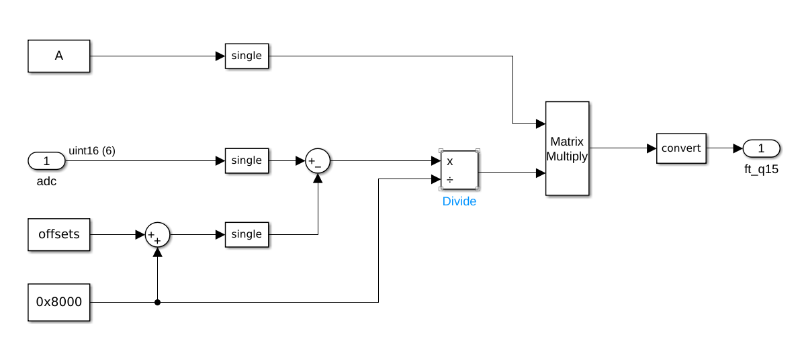
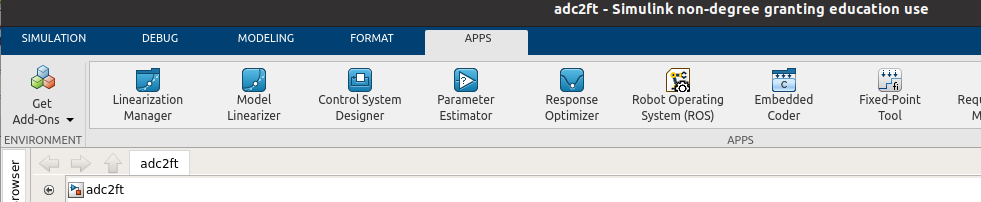
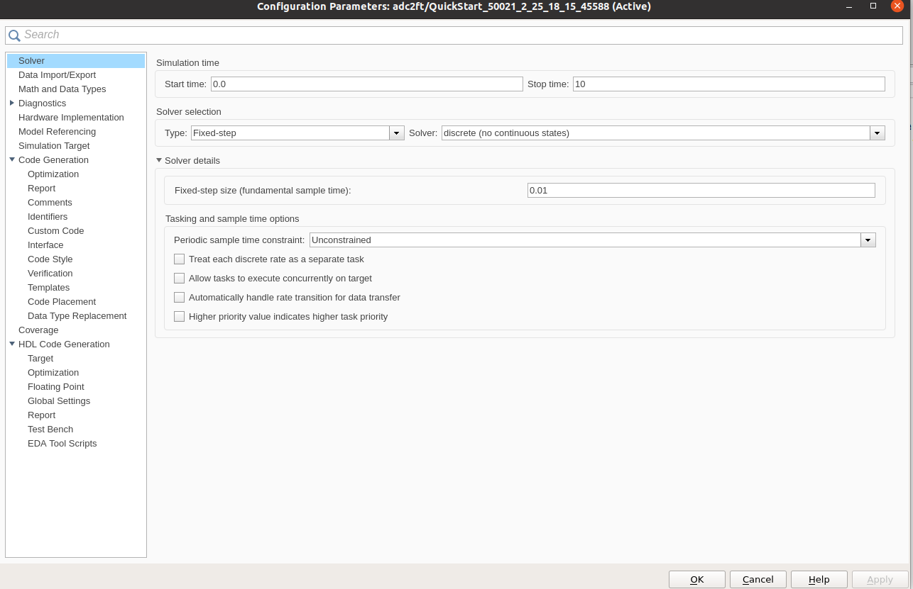
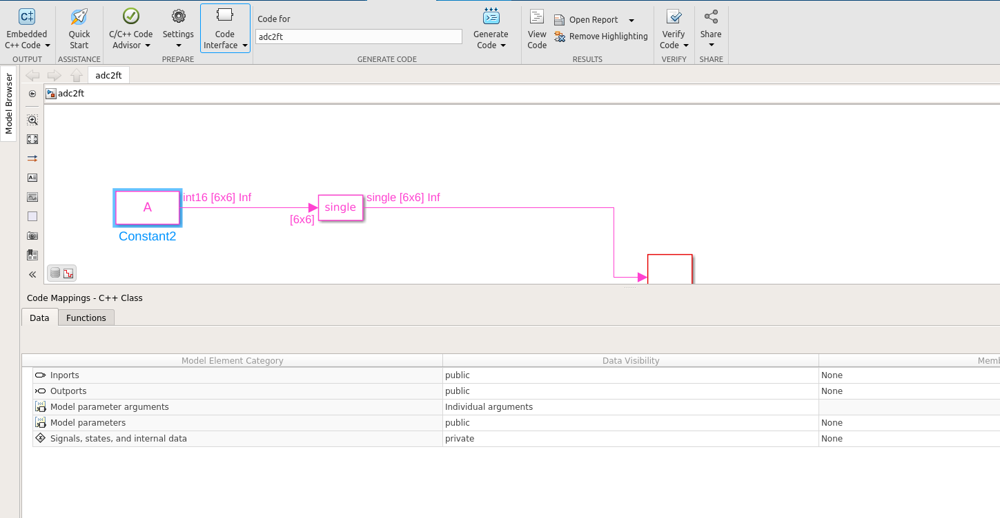

# 1. Introduction
This folder contains the Simulink model for the Force-Torque sensor firmware.

The model is used for code generation.

# 2. Version

| Application | version |
| ----------- | ------- |
| MATLAB      |2021a         |
| Simulink    |2021a         |
| C++         |C++11         |
| Model       |v1.0.0        |

# 3. The model
The model implements the conversion from ADC raw values to Force-Torque values in the Strain2 sensor.

## 3.1. Input
ADC raw values are an array of 6 values, 16 bit each, type: **unsigned**.

## 3.2. Output
Force-Torque values are an array of 6 values, 16 bit each, type: **Q15**.  
The output is back-compatible with the current YARP implementation.

## 3.3. Parameters
- Conversion matrix dimensions 6x6, 16 bit each, type: **integer**.
- Offset dimensions 6x1, 16 bit each, type: **unsigned**.

# 4. Code generation
In order to generate the C++ code, open the `Embedded Coder` application on Simulink tab.

  
  
 

Set the correct parameters in `C/C++ Settings --> Code generation settings --> Solver`.

Finally, use the `Generate code` button.

# 5. Note

## 5.1. Public parameters
The parameters needs to have public access.
To specify that, click on the `Code Interface` button of tha App and then the `Model parameters` option.  

